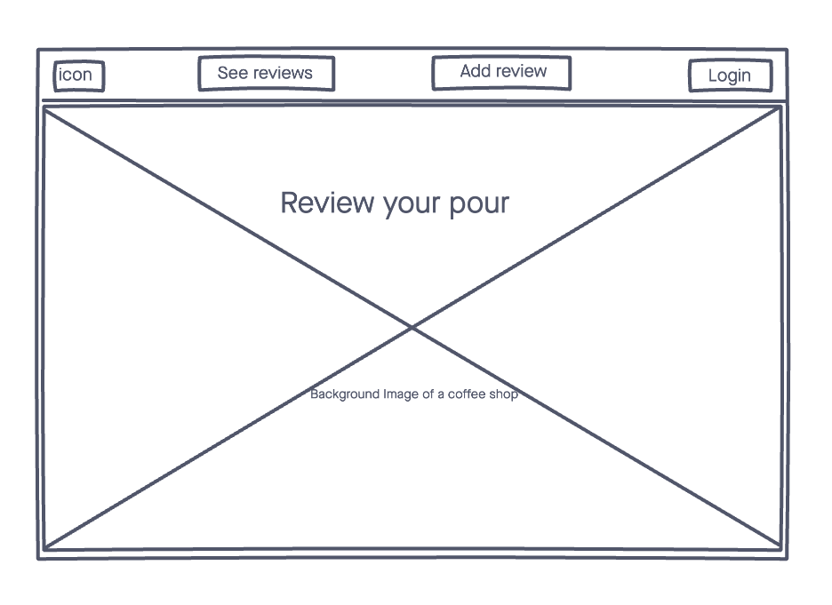
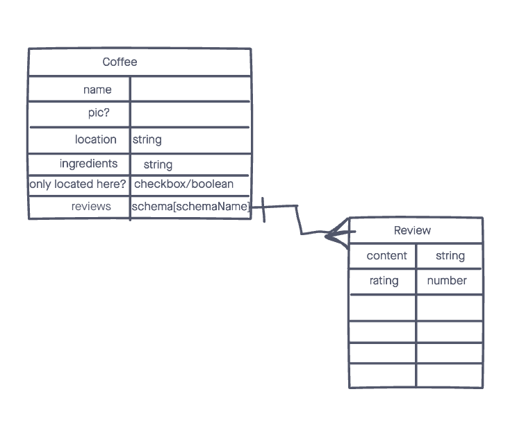

# Review Your Pour 

An application used to track types of coffee that you've had and where you've had it. The user can input reviews and their notes of their experience. The user can see their list as they input new coffees as well as edit or delete anything from that list when they choose. 

## Technologies Used 

- HTML5
- CSS3
- Javascript
- Node.js
- Bootstrap
- Mongoose.JS
- MongoDB
- Express.JS
- Morgan
- EJS
- Font Awesome

## Screenshots
### Landing Page wireframe:

### ERD first draft

<!-- insert more -->

## Getting Started
[Click Here](#) to see the deployed app!

## Future Enhancements
- allow user to upload pictures using AmazonS3 or Cloudinary
