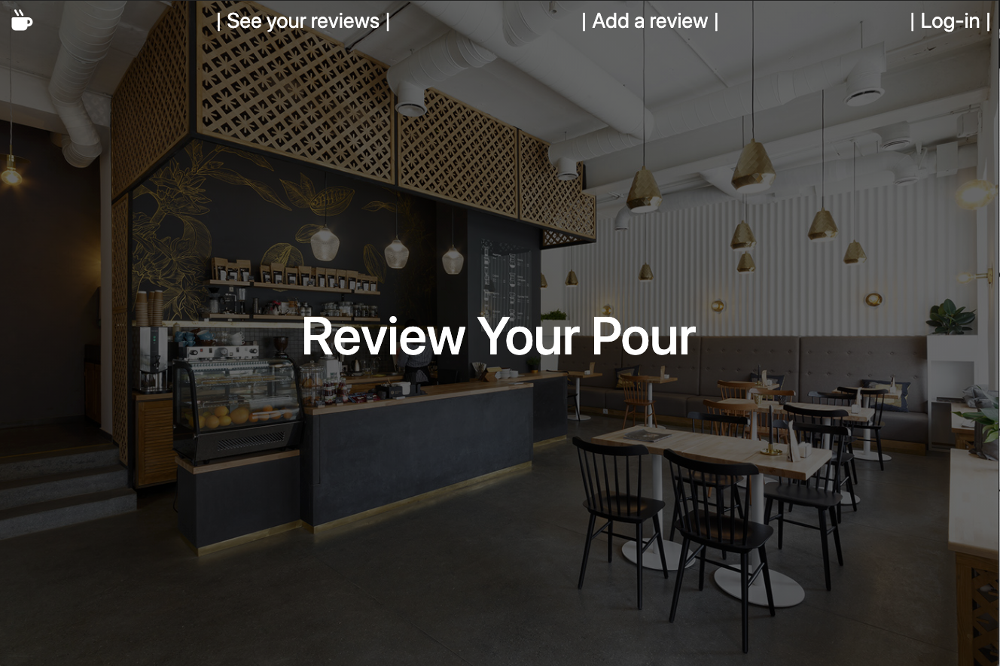

# Review Your Pour 

An application used to track types of coffee that you've had and where you've had it. The user can input reviews and their notes of their experience. The user can see their list as they input new coffees as well as edit or delete anything from that list when they choose. 

## Technologies Used 

- HTML5
- CSS3
- Javascript
- Node.js
- Bootstrap
- Mongoose.JS
- MongoDB
- Express.JS
- Morgan
- EJS
- Font Awesome
- bcrypt

## Screenshots
### Landing Page wireframe:

### Landing Page in action

### ERD first draft

<!-- insert more -->

## Getting Started
[Click Here](#) to see the deployed app!

## Future Enhancements
- allow user to upload pictures using AmazonS3 or Cloudinary
- restrict access to users to certain features(edit, delete, etc) unless they created the resource
- add authorization

<!-- ## Notes
- add an about section on the site
- add a footer with my linkedin and github 
- add jQuery to the icon on login page to alert that the coffee is how when clicked
- add imgURL input box assigned as a string for user to input url
-->
